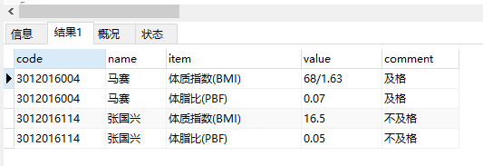
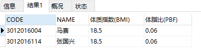
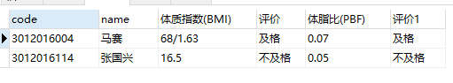

# 行转列

		需求说明
		设计方法
		代码实现
		优化代码(推荐)


## 需求说明

### 表和数据

```sql
select code, name, item, value, comment  from fit_student_item_score 
where title = 'test3';
```
数据如下：


### 期望目标

期望达到目标：
**一行转一个列**

**一行转多个列**


## 设计方法

我们通过group汇总方法就可以实现

```sql
select fsis.code, fsis.name,
	MAX(IF(fsis.item = '体质指数(BMI)', fsis.value, 0)) AS '体质指数(BMI)',
	MAX(IF(fsis.item = '体脂比(PBF)', fsis.value, 0)) AS '体脂比(PBF)'
from fit_student_item_score fsis 
where fsis.title = 'test3' 
group by fsis.code, fsis.name;
```

```sql
select fsis.code, fsis.name,
	MAX(IF(fsis.item = '体质指数(BMI)', fsis.value, 0)) AS '体质指数(BMI)',
	MAX(IF(fsis.item = '体质指数(BMI)', fsis.comment, 0)) AS '评价',
	MAX(IF(fsis.item = '体脂比(PBF)', fsis.value, 0)) AS '体脂比(PBF)',
	MAX(IF(fsis.item = '体脂比(PBF)', fsis.comment, 0)) AS '评价'
from fit_student_item_score fsis 
where fsis.title = 'test3' 
group by fsis.code, fsis.name;
```

但是这种方法，基于item的值是固定的，是 **静态行转列**

一般情况下，行数的值是动态的，因此我们要实现**动态行转列**


那么如何进行动态行转列呢？

关键是要获取下面的语句

```sql
	MAX(IF(fsis.item = '体质指数(BMI)', fsis.value, 0)) AS '体质指数(BMI)',
	MAX(IF(fsis.item = '体质指数(BMI)', fsis.comment, 0)) AS '评价',
	MAX(IF(fsis.item = '体脂比(PBF)', fsis.value, 0)) AS '体脂比(PBF)',
	MAX(IF(fsis.item = '体脂比(PBF)', fsis.comment, 0)) AS '评价'
```

这些语句通过动态sql来拼接来实现


## 代码实现

下面我以一行转一列的实例来说明

### 拼接列栏位

```sql
	SELECT
		GROUP_CONCAT(
			DISTINCT CONCAT(
				'MAX(IF(fsis.item = ''',
				fsis.item,
				''', fsis.value, 0)) AS ''',
				fsis.item,
				''''
			)
		)
	FROM
		fit_student_item_score fsis
	WHERE
		fsis.title = 'test3';
```
运行结果：`MAX(IF(fsis.item = '体质指数(BMI)', fsis.value, 0)) AS '体质指数(BMI)',MAX(IF(fsis.item = '体脂比(PBF)', fsis.value, 0)) AS '体脂比(PBF)'`

### 拼接完整语句

```sql
set @subsql = '';

SELECT
	GROUP_CONCAT(
		DISTINCT CONCAT(
			'MAX(IF(fsis.item = ''',
			fsis.item,
			''', fsis.great, 0)) AS ''',
			fsis.item,
			''''
		)
	) into @subsql
FROM
	fit_student_item_score fsis
WHERE
	fsis.title = 'test3';

set @sql = CONCAT(' SELECT fsis.CODE, fsis.NAME, ', @subsql,
								  ' FROM fit_student_item_score fsis
									  WHERE fsis.title = ''test3''',
									' GROUP BY fsis.CODE, fsis.NAME');

-- select @sql;
PREPARE stmt FROM @sql;
EXECUTE stmt ;
DEALLOCATE PREPARE stmt;

```

为了更好提供给应用程序调用，将上面脚本转换为存储过程

### 编写存储过程

```sql
DROP PROCEDURE IF EXISTS SP_QueryTest ; 
CREATE PROCEDURE SP_QueryTest (IN title VARCHAR(30)) 
READS SQL DATA
BEGIN
	SET @subsql = '' ;
	SET @title = title ; 
  SELECT
		GROUP_CONCAT(
			DISTINCT CONCAT(
				'MAX(IF(fsis.item = ''',
				fsis.item,
				''', fsis.great, 0)) AS ''',
				fsis.item,
				''''
			)
		) INTO @subsql
	FROM
		fit_student_item_score fsis
	WHERE
		fsis.title = @title ;
	SET @SQL = CONCAT(
		' SELECT fsis.CODE, fsis.NAME, ',
		@subsql,
		' FROM fit_student_item_score fsis WHERE fsis.title = ''',
		@title,
		'''GROUP BY fsis.CODE, fsis.NAME') ; 
	PREPARE stmt FROM @SQL ; 
  EXECUTE stmt ; 
  DEALLOCATE PREPARE stmt ;
END
```

调用脚本: 'call SP_QueryTest('test3');'


## 优化代码(推荐)

若item栏位很多的情况下，使用GROUP_CONCAT函数返回的字符串因为过程，将被截断，引起脚本报错，

因此上面存储过程一般 **只支持12列左右**。

优化上面代码，拼接的脚本不受限制

将拼接的脚本，使用函数来完成


### mysql配置

-- 若mysql开启二进制日志后,需开启下面的开关才能创建函数

```sql
show variables like 'log_bin_trust_function_creators';
SET GLOBAL log_bin_trust_function_creators=1;
SET GLOBAL log_bin_trust_function_creators=0;
```

### 重构拼接列脚本

```sql
drop function if exists get_concat_strs;
create function get_concat_strs(i_title varchar(30)) returns varchar(3000)
begin
  declare b int default 0;
  declare l_subsql, l_sql varchar(3000) default '';
  declare cur_1 cursor for 
	SELECT
		GROUP_CONCAT(
			DISTINCT CONCAT(
				'MAX(IF(fsis.item = ''',
				fsis.item,
				''', fsis.value, ''-'')) AS ''',
				fsis.item,
				''',',
				'MAX(IF(fsis.item = ''',
				fsis.item,
				''', fsis.comment, ''-'')) AS ''',
				'评价',
				''''
			)
		) as sstr
	FROM
		fit_student_item_score fsis
	WHERE
		fsis.title = i_title
  group by fsis.item,fsis.fic_id order by fsis.fic_id;

  declare continue handler for not found set b=1;

  open cur_1;
    repeat
      fetch cur_1 into l_subsql;
      if (l_sql = '') then 
        set l_sql= l_subsql;
      else
        set l_sql= CONCAT(l_sql,',',l_subsql);
      end if;
    until b=1 end repeat;
  close cur_1;
  
  return l_sql;
end;

```

运行函数：
```sql
set @sql = get_concat_strs('test3');
select @sql;

```

###  重写行转列存储过程

```sql
drop procedure if exists SP_QueryTest2;
Create Procedure SP_QueryTest2(i_title varchar(30))
READS SQL DATA 
BEGIN
  set @subsql= get_concat_strs(i_title);
  set @mainsql= CONCAT('SELECT fsis.NAME, fsis.CODE ', @subsql, 
					' FROM fit_student_item_score fsis ',
					'	WHERE fsis.title = ''', i_title, '''',
					'	GROUP BY fsis.NAME, fsis.CODE ');

  PREPARE stmt FROM @mainsql;
  EXECUTE stmt ;
  DEALLOCATE PREPARE stmt;
END;
```

运行函数：'call SP_QueryTest2('test3') '