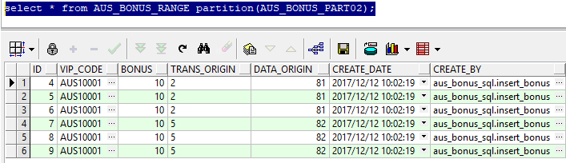
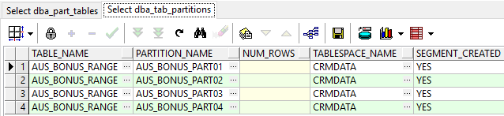
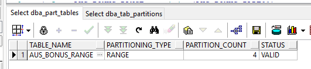

# sql   ------  partition 

		1. 为什么要分区
		2. 需要表分区的依据
		3. 表分区策略
		4. 分区实现方法
		5. 如何查询分区数据
		6. 表分区维护-
			新增分区
			删除分区
			合并分区
			拆分分区

## 1. 为什么要对表分区

* 可极大提高数据查询，更新操作。
* 按分区管理和维护，提高表的可用性，维护性; 表的某个分区出现故障，表在其他分区的数据仍然可用。


##  2. 需要表分区的依据

* 表的大小超过2GB或含有1000万条记录以上的表
* 表中包含历史数据，新的数据被增加都新的分区中。
* 可利于并行操作的表
* 含有需要定期归档或删除部分的表。

查看表容量请参考脚本
```
select *
  from (select owner,
               segment_name,
               segment_type,
               partition_name,
               sum(bytes) / 1024 / 1024 meg_tot
          from dba_segments
         group by owner, segment_name, segment_type, partition_name
         order by sum(bytes) desc)
 where rownum <= 20
```

## 3. 表分区策略 

|分区|名称|描述|
|-|-|-|
|RANGE|范围|根据日期,数值或字符创建分区|
|LIST|列表|根据列表值创建分区|
|HASH|散列|在没有明显分区键的情况下，以均分方式创建分区| 

组合分区 
组合多种分区方式,可以按照上面三种取两种进行组合
支持方式有 
* RANGE-RANGE, RANGE-LIST, RANGE-HASH 
* LIST-RANGE, LIST-LIST, LIST-HASH

间隔-自动分配分区
当新分区键值超出现存最大范围时，通过自动分配新分区扩展范围分区 

还存在

引用-根据父表列为子表创建分区 
虚拟列分区-在虚拟列上创建分区 
系统-根据插入数据的应用程序创建分区

## 4. 表分区实现

下面我们通过一张实例表来实现不同分区策略

提示下面脚本使用演示用的表空间，实际我在测试指定的表空间为CRMDATA

### 正常表创建

```
CREATE TABLE AUS_BONUS
(
  id            NUMBER(16) NOT NULL,   --id
  vip_code      VARCHAR2(20) NOT NULL,  --卡号
  bonus         NUMBER NOT NULL,             --积分
  trans_origin  VARCHAR2(10),      --1=初始积分 2=交易送积分-线下5=积分兑换 7=交易退积分 9=调整积分
  data_origin   NUMBER NOT NULL,    --81=达芙妮微信公众号 82=鞋柜微信公众号 83=圆漾微信公众号
  create_date   DATE NOT NULL,
  create_by     VARCHAR2(256),
  constraint PK_AUS_BONUS primary key (id)
);

```
--插入数据
```
delete from AUS_BONUS;
insert into AUS_BONUS values(1, 'AUS10001', 10, 1, 81,sysdate-730,'aus_bonus_sql.insert_bonus');
insert into AUS_BONUS values(2, 'AUS10001', 10, 1, 81,sysdate,'aus_bonus_sql.insert_bonus');
insert into AUS_BONUS values(3, 'AUS10001', 10, 1, 81,sysdate,'aus_bonus_sql.insert_bonus');
insert into AUS_BONUS values(4, 'AUS10001', 10, 2, 81,sysdate-365,'aus_bonus_sql.insert_bonus');
insert into AUS_BONUS values(5, 'AUS10001', 10, 2, 81,sysdate-365,'aus_bonus_sql.insert_bonus');
insert into AUS_BONUS values(6, 'AUS10001', 10, 2, 81,sysdate-365,'aus_bonus_sql.insert_bonus');
insert into AUS_BONUS values(7, 'AUS10001', 10, 2, 82,sysdate-365,'aus_bonus_sql.insert_bonus');
insert into AUS_BONUS values(8, 'AUS10001', 10, 5, 82,sysdate-365,'aus_bonus_sql.insert_bonus');
insert into AUS_BONUS values(9, 'AUS10001', 10, 5, 82,sysdate-365,'aus_bonus_sql.insert_bonus');
insert into AUS_BONUS values(10, 'AUS10001', 10, 2, 82,sysdate+365,'aus_bonus_sql.insert_bonus');
insert into AUS_BONUS values(11, 'AUS10001', 10, 7, 82,sysdate+365,'aus_bonus_sql.insert_bonus');
insert into AUS_BONUS values(12, 'AUS10001', 10, 7, 82,sysdate+365,'aus_bonus_sql.insert_bonus');
insert into AUS_BONUS values(13, 'AUS10001', 10, 2, 83,sysdate,'aus_bonus_sql.insert_bonus');
insert into AUS_BONUS values(14, 'AUS10001', 10, 9, 83,sysdate,'aus_bonus_sql.insert_bonus');
insert into AUS_BONUS values(15, 'AUS10001', 10, 9, 83,sysdate,'aus_bonus_sql.insert_bonus');
insert into AUS_BONUS values(16, 'AUS10001', 10, 9, 84,sysdate+720,'aus_bonus_sql.insert_bonus');
insert into AUS_BONUS values(17, 'AUS10001', 10, 2, 84,sysdate+720,'aus_bonus_sql.insert_bonus');
select * from AUS_BONUS;
```

查看分区字典信息

```
select table_name,partitioning_type,partition_count,status 
from dba_part_tables 
where table_name='AUS_BONUS';

select table_name,partition_name,num_rows,tablespace_name,segment_created
from dba_tab_partitions 
where table_name='AUS_BONUS';

select partition_name,subpartition_name,tablespace_name,num_rows,segment_created 
from dba_tab_subpartitions 
where table_name='AUS_BONUS';
```

### 1. 范围分区策略 - RANGE 

下面我们通过 **create_date** 日期来分区设置

#### 创建分区表
```
CREATE TABLE AUS_BONUS_RANGE
(
  id            NUMBER(16) NOT NULL,   --id
  vip_code      VARCHAR2(20) NOT NULL,  --卡号
  bonus         NUMBER NOT NULL,             --积分
  trans_origin  VARCHAR2(10),      --1=初始积分 2=交易送积分-线下5=积分兑换 7=交易退积分 9=调整积分
  data_origin   NUMBER NOT NULL,    --81=达芙妮微信公众号 82=鞋柜微信公众号 83=圆漾微信公众号
  create_date   DATE NOT NULL,
  create_by     VARCHAR2(256),
  constraint PK_AUS_BONUS_RANGE primary key (id)
) 
PARTITION BY RANGE(create_date)
(
PARTITION AUS_BONUS_PART01 VALUES LESS THAN (to_date('2017-01-01','yyyy-mm-dd') ) TABLESPACE test_tbs_01,
PARTITION AUS_BONUS_PART02 VALUES LESS THAN (to_date('2018-01-01','yyyy-mm-dd') ) TABLESPACE test_tbs_02,
PARTITION AUS_BONUS_PART03 VALUES LESS THAN (to_date('2019-01-01','yyyy-mm-dd') ) TABLESPACE test_tbs_03,
PARTITION AUS_BONUS_PART04 VALUES LESS THAN (MAXVALUE) TABLESPACE test_tbs_04
);
```

执行上面脚本，请注意表空间修改为已经存在的表空间，若使用用户默认的表空间，可以省略表空间语句(TABLESPACE test_tbs_01)

MAXVALUE 日期表示不在前面的分区中，则就存放在最大值分区中

每个表分区使用独立的表空间，有利提供数据查询，更新操作，也方便于管理。

从语法上看，可以省略表空间(TABLESPACE test_tbs_01),使用默认表空间进行创建。

真正在使用过程中，不建议使用MAXVALUE来创建分区

#### 操作数据
```
delete from AUS_BONUS_RANGE;
insert into AUS_BONUS_RANGE  select * from AUS_BONUS;
select * from AUS_BONUS_RANGE partition(AUS_BONUS_PART01);
select * from AUS_BONUS_RANGE partition(AUS_BONUS_PART02);
select * from AUS_BONUS_RANGE partition(AUS_BONUS_PART03);
select * from AUS_BONUS_RANGE partition(AUS_BONUS_PART04);
```


#### 查询分区字典信息，参考上面
```
select table_name,partitioning_type,partition_count,status 
from dba_part_tables 
where table_name='AUS_BONUS_RANGE';
```

```
select table_name,partition_name,num_rows,tablespace_name,segment_created
from dba_tab_partitions 
where table_name='AUS_BONUS_RANGE';
```


### 2. 列表分区策略 - LIST 

下面我们通过 **data_origin** 固定值来分区设置

#### 创建分区表

```
CREATE TABLE AUS_BONUS_LIST
(
  id            NUMBER(16) NOT NULL,   --id
  vip_code      VARCHAR2(20) NOT NULL,  --卡号
  bonus         NUMBER NOT NULL,             --积分
  trans_origin  VARCHAR2(10),      --1=初始积分 2=交易送积分-线下5=积分兑换 7=交易退积分 9=调整积分
  data_origin   NUMBER NOT NULL,    --81=达芙妮微信公众号 82=鞋柜微信公众号 83=圆漾微信公众号
  create_date   DATE NOT NULL,
  create_by     VARCHAR2(256),
  constraint PK_AUS_BONUS_LIST primary key (id)
) 
PARTITION BY LIST(data_origin)
(
PARTITION AUS_BONUS_PART01 VALUES (81) TABLESPACE test_tbs_01,
PARTITION AUS_BONUS_PART02 VALUES (82) TABLESPACE test_tbs_02,
PARTITION AUS_BONUS_PART03 VALUES (83) TABLESPACE test_tbs_03,
PARTITION AUS_BONUS_PART04 VALUES (DEFAULT) TABLESPACE test_tbs_04
);
```

DEFAULT 列表的值不在前面的分区中，则就存放在这个默认分区中

每个表分区使用独立的表空间，有利提供数据查询，更新操作，也方便于管理。

从语法上看，可以省略表空间(TABLESPACE test_tbs_01),使用默认表空间进行创建。

#### 操作数据
```
delete from AUS_BONUS_LIST;
insert into AUS_BONUS_LIST as select * from AUS_BONUS;

select * from AUS_BONUS_LIST partition(AUS_BONUS_PART01);
select * from AUS_BONUS_LIST partition(AUS_BONUS_PART02);
select * from AUS_BONUS_LIST partition(AUS_BONUS_PART03);
select * from AUS_BONUS_LIST partition(AUS_BONUS_PART04);
```

#### 查询分区字典信息，脚本参考上面
```
select table_name,partitioning_type,partition_count,status 
from dba_part_tables 
where table_name='AUS_BONUS_LIST';

select table_name,partition_name,num_rows,tablespace_name,segment_created
from dba_tab_partitions 
where table_name='AUS_BONUS_LIST';
```

### 3. 散列分区策略 - HASH

下面我们通过 **id** 利用散列算法，将数据均摊到不同分区中

#### 创建分区表
```
CREATE TABLE AUS_BONUS_HASH
(
  id            NUMBER(16) NOT NULL,   --id
  vip_code      VARCHAR2(20) NOT NULL,  --卡号
  bonus         NUMBER NOT NULL,             --积分
  trans_origin  VARCHAR2(10),      --1=初始积分 2=交易送积分-线下5=积分兑换 7=交易退积分 9=调整积分
  data_origin   NUMBER NOT NULL,    --81=达芙妮微信公众号 82=鞋柜微信公众号 83=圆漾微信公众号
  create_date   DATE NOT NULL,
  create_by     VARCHAR2(256),
  constraint PK_AUS_BONUS_HASH primary key (id)
) 
PARTITION BY HASH(id)
(
PARTITION AUS_BONUS_PART01 TABLESPACE test_tbs_01,
PARTITION AUS_BONUS_PART02 TABLESPACE test_tbs_02,
PARTITION AUS_BONUS_PART03 TABLESPACE test_tbs_03,
PARTITION AUS_BONUS_PART04 TABLESPACE test_tbs_04
);
alter table AUS_BONUS_HASH add primary key (ID);
```

DEFAULT 列表的值不在前面的分区中，则就存放在这个默认分区中

每个表分区使用独立的表空间，有利提供数据查询，更新操作，也方便于管理。

从语法上看，可以省略表空间(TABLESPACE test_tbs_01),使用默认表空间进行创建。

#### 操作数据
```
delete from AUS_BONUS_HASH;
insert into AUS_BONUS_HASH as select * from AUS_BONUS;
select * from AUS_BONUS_HASH partition(AUS_BONUS_PART01);
select * from AUS_BONUS_HASH partition(AUS_BONUS_PART02);
select * from AUS_BONUS_HASH partition(AUS_BONUS_PART03);
select * from AUS_BONUS_HASH partition(AUS_BONUS_PART04);
```

#### 查询分区字典信息，脚本参考上面
```
select table_name,partitioning_type,partition_count,status 
from dba_part_tables 
where table_name='AUS_BONUS_HASH';

select table_name,partition_name,num_rows,tablespace_name,segment_created
from dba_tab_partitions 
where table_name='AUS_BONUS_HASH';
```

### 4. 组合分区策略

下面我们通过两种分区策略来实现分区  LIST-LIST
使用data_origin和trans_origin栏位来分区

#### 创建分区表

```
CREATE TABLE AUS_BONUS_LIST_LIST
(
  id            NUMBER(16) NOT NULL,   --id
  vip_code      VARCHAR2(20) NOT NULL,  --卡号
  bonus         NUMBER NOT NULL,             --积分
  trans_origin  VARCHAR2(10),      --1=初始积分 2=交易送积分-线下5=积分兑换 7=交易退积分 9=调整积分
  data_origin   NUMBER NOT NULL,    --81=达芙妮微信公众号 82=鞋柜微信公众号 83=圆漾微信公众号
  create_date   DATE NOT NULL,
  create_by     VARCHAR2(256),
  constraint PK_AUS_BONUS_LIST_LIST primary key (id)
) 
PARTITION BY LIST(data_origin)
SUBPARTITION BY LIST(trans_origin)
(
PARTITION AUS_BONUS_PART01 VALUES (81) TABLESPACE test_tbs_01
  (
    SUBPARTITION AUS_BONUS_SUB_PART01 VALUES('1', '5','7', '9') tablespace test_tbs_01,
    SUBPARTITION AUS_BONUS_SUB_PART02 VALUES('2') tablespace test_tbs_01
  ),
PARTITION AUS_BONUS_PART02 VALUES (82) TABLESPACE test_tbs_02
  (
    SUBPARTITION AUS_BONUS_SUB_PART03 VALUES('1', '5','7', '9') tablespace test_tbs_02,
    SUBPARTITION AUS_BONUS_SUB_PART04 VALUES('2') tablespace test_tbs_02
  ),
PARTITION AUS_BONUS_PART03 VALUES (83) TABLESPACE test_tbs_03
  (
    SUBPARTITION AUS_BONUS_SUB_PART05 VALUES('1', '5','7', '9') tablespace test_tbs_03,
    SUBPARTITION AUS_BONUS_SUB_PART06 VALUES('2') tablespace test_tbs_03
  ),
PARTITION AUS_BONUS_PART04 VALUES (DEFAULT) TABLESPACE test_tbs_04
  (
    SUBPARTITION AUS_BONUS_SUB_PART07 VALUES('1', '5','7', '9') tablespace test_tbs_04,
    SUBPARTITION AUS_BONUS_SUB_PART08 VALUES('2') tablespace test_tbs_04
  )
);
```

指定表空间时，以子分区为优先分配

从语法上看，可以省略表空间(TABLESPACE test_tbs_01),使用默认表空间进行创建。

#### 操作数据
```
delete from AUS_BONUS_LIST_LIST;
insert into AUS_BONUS_LIST_LIST as select * from AUS_BONUS;

select * from AUS_BONUS_LIST_LIST partition(AUS_BONUS_PART01);
select * from AUS_BONUS_LIST_LIST partition(AUS_BONUS_PART02);
select * from AUS_BONUS_LIST_LIST partition(AUS_BONUS_PART03);
select * from AUS_BONUS_LIST_LIST partition(AUS_BONUS_PART04);

select * from AUS_BONUS_LIST_LIST subpartition(AUS_BONUS_SUB_PART01);
select * from AUS_BONUS_LIST_LIST subpartition(AUS_BONUS_SUB_PART02);
select * from AUS_BONUS_LIST_LIST subpartition(AUS_BONUS_SUB_PART03);
select * from AUS_BONUS_LIST_LIST subpartition(AUS_BONUS_SUB_PART04);
select * from AUS_BONUS_LIST_LIST subpartition(AUS_BONUS_SUB_PART05);
select * from AUS_BONUS_LIST_LIST subpartition(AUS_BONUS_SUB_PART06);
select * from AUS_BONUS_LIST_LIST subpartition(AUS_BONUS_SUB_PART07);
select * from AUS_BONUS_LIST_LIST subpartition(AUS_BONUS_SUB_PART08);
```

#### 查询分区字典信息，脚本参考上面
```
select table_name,partitioning_type,partition_count,status 
from dba_part_tables 
where table_name='AUS_BONUS_LIST_LIST';

select table_name,partition_name,num_rows,tablespace_name,segment_created
from dba_tab_partitions 
where table_name='AUS_BONUS_LIST_LIST';

select partition_name,subpartition_name,tablespace_name,num_rows,segment_created 
from dba_tab_subpartitions 
where table_name='AUS_BONUS_LIST_LIST';
```

## 5. 如何查询分区数据

通过分区查看业务数据
```
select * from AUS_BONUS_RANGE partition(AUS_BONUS_PART01);

select * from AUS_BONUS_LIST_LIST partition(AUS_BONUS_SUB_PART01);

select * from AUS_BONUS_LIST_LIST subpartition(AUS_BONUS_SUB_PART01);
```

查看分区信息
```
select table_name,partitioning_type,partition_count,status 
from dba_part_tables 
where table_name='AUS_BONUS_LIST_LIST';

select table_name,partition_name,num_rows,tablespace_name,segment_created
from dba_tab_partitions 
where table_name='AUS_BONUS_LIST_LIST';

select partition_name,subpartition_name,tablespace_name,num_rows,segment_created 
from dba_tab_subpartitions 
where table_name='AUS_BONUS_LIST_LIST';
```

## 6. 表分区维护

### 添加分区 

新增分区: AUS_BONUS_RANGE新增AUS_BONUS_PART05分区
```
ALTER TABLE AUS_BONUS_RANGE 
ADD PARTITION AUS_BONUS_PART05 VALUES LESS THAN(TO_DATE('2020-01-01','YYYY-MM-DD'));
```
注意：以上添加的分区界限应该高于最后一个分区界限。若直接执行将提示报错，删除AUS_BONUS_PART04分区，或重新表。

新增子分区: AUS_BONUS_LIST_LIST的AUS_BONUS_PART04分区,新增AUS_BONUS_SUB_PART03子分区
```
ALTER TABLE AUS_BONUS_LIST_LIST MODIFY PARTITION AUS_BONUS_SUB_PART03
ADD SUBPARTITION AUS_BONUS_SUB_PART03 VALUES('3');
```

### 删除分区 

删除分区: AUS_BONUS_RANGE删除AUS_BONUS_PART05分区：
`ALTER TABLE AUS_BONUS_RANGE DROP PARTITION AUS_BONUS_PART05;`

删除子分区: AUS_BONUS_RANGE删除AUS_BONUS_SUB_PART03子分区：
`ALTER TABLE AUS_BONUS_RANGE DROP SUBPARTITION AUS_BONUS_SUB_PART03;`

注意：如果删除的分区是表中唯一的分区，那么此分区将不能被删除，要想删除此分区，必须删除表。

### 截断分区 
截断某个分区是指删除某个分区中的数据，并不会删除分区，也不会删除其它分区中的数据。

当表中即使只有一个分区时，也可以截断该分区。通过以下代码截断分区：

`ALTER TABLE AUS_BONUS_RANGE TRUNCATE PARTITION AUS_BONUS_PART04;`

通过以下代码截断子分区：

`ALTER TABLE AUS_BONUS_RANGE TRUNCATE SUBPARTITION AUS_BONUS_SUB_PART02;`

### 合并分区 
合并分区是将相邻的分区合并成一个分区，结果分区将采用较高分区的界限，

值得注意的是，不能将分区合并到界限较低的分区。以下代码实现了P1 P2分区的合并：

`ALTER TABLE AUS_BONUS_RANGE MERGE PARTITIONS AUS_BONUS_PART03,AUS_BONUS_PART04 INTO PARTITION AUS_BONUS_PART04;`

### 拆分分区 ？
拆分分区将一个分区拆分两个新分区，拆分后原来分区不再存在。注意不能对HASH类型的分区进行拆分。

`ALTER TABLE SALES SBLIT PARTITION P2 AT(TO_DATE('2003-02-01','YYYY-MM-DD')) INTO (PARTITION P21,PARTITION P22);`

### 接合分区(coalesca) ？
结合分区是将散列分区中的数据接合到其它分区中，当散列分区中的数据比较大时，可以增加散列分区，然后进行接合，

值得注意的是，接合分区只能用于散列分区中。通过以下代码进行接合分区：

`ALTER TABLE SALES COALESCA PARTITION;`

### 重命名表分区 
以下代码将P21更改为P2

`ALTER TABLE AUS_BONUS_RANGE RENAME PARTITION AUS_BONUS_PART02 TO AUS_BONUS_PART05;`

7. 清除所有对象

上面的实例，我们只是会了验证表分区的使用，使用结束后，应该清除

```
DROP TABLE AUS_BONUS_RANGE;
DROP TABLE AUS_BONUS_LIST;
DROP TABLE AUS_BONUS_HASH;
DROP TABLE AUS_BONUS_LIST_LIST;

```

8. 扩展了解表空间

查看文件对应表空间

`select * from dba_data_files;`

--查看表空间的使用情况
```
SELECT a.tablespace_name,
       total ,
       free ,
       (total - free) used,
       total / (1024 * 1024 * 1024) total_G,
       free / (1024 * 1024 * 1024) free_G ,
       (total - free) / (1024 * 1024 * 1024) userd_G ,
       round((total - free) / total, 4) * 100 使用率
  FROM (SELECT tablespace_name, SUM(bytes) free
          FROM dba_free_space
         GROUP BY tablespace_name) a,
       (SELECT tablespace_name, SUM(bytes) total
          FROM dba_data_files
         GROUP BY tablespace_name) b
 WHERE a.tablespace_name = b.tablespace_name;
```

表空间对应物理文件
```
select tablespace_name,
       file_id,
       file_name,
       round(bytes / (1024 * 1024), 0) total_space
  from dba_data_files
 order by tablespace_name
```
